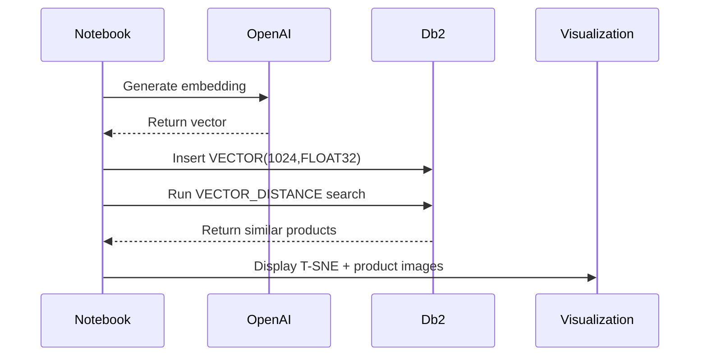

# Semantic Product Recommendation using Db2 Vector AI and OpenAI Embeddings

This project demonstrates an end-to-end semantic search and product recommendation workflow using Db2 Vector AI and OpenAI embeddings. It covers dataset generation, embedding creation, vector storage, semantic similarity search, and image-based visualization in Jupyter notebooks.

The pipeline includes:

- Embedding generation using OpenAI (text-embedding-3-large)
- Vector storage inside Db2 using VECTOR(1024, FLOAT32)
- Semantic similarity search using VECTOR_DISTANCE
- Visualization (T-SNE plots, product image preview)
- A full notebook-driven workflow

---

## Architecture


---

## Repository Structure

```
shoes-data-generation.ipynb     # Synthetic dataset creation
shoes-data-partitioning.ipynb   # Store-wise data partitioning
shoes-search.ipynb              # Semantic search + visualization
shoes.csv                       # Base dataset
shoes-vectors.csv               # Dataset with embeddings
images/                         # Product images
utils.py                        # Helper functions
requirements.txt                # Dependencies
.env-sample                     # Environment variable template
README.md                       # Documentation
```

---

## Setup Instructions

### 1. Create and activate a virtual environment

```bash
uv venv --python=python3.12
source .venv/bin/activate
```

### 2. Install dependencies

```bash
uv pip install -r requirements.txt
```

---

## Environment Configuration

Create a `.env` file using the template:

```
OPENAI_API_KEY=your_key_here
OPENAI_BASE_URL=https://api.openai.com/v1
OPENAI_EMBED_MODEL=text-embedding-3-large

database=
hostname=localhost
port=
protocol=TCPIP
uid=
pwd=
```

---

## Db2 Table Schema

```sql
CREATE TABLE SQ_SHOES (
  SKU VARCHAR(8),
  PRODUCT_NAME VARCHAR(23),
  BRAND VARCHAR(9),
  CLASS VARCHAR(5),
  TYPE VARCHAR(7),
  MATERIAL VARCHAR(9),
  COLOR VARCHAR(5),
  WEATHER_RESISTANCE VARCHAR(10),
  ARCH_SUPPORT VARCHAR(4),
  SIZE FLOAT,
  PRICE FLOAT,
  RATING FLOAT,
  STORE_ID BIGINT,
  CITY VARCHAR(7)
);
```

Add vector column:

```sql
ALTER TABLE SQ_SHOES
ADD COLUMN EMBEDDING VECTOR(1024, FLOAT32);
```

---

## Generating Embeddings (OpenAI)

```python
from openai import OpenAI
from dotenv import load_dotenv
import os

load_dotenv()
client = OpenAI()

response = client.embeddings.create(
    model=os.getenv("OPENAI_EMBED_MODEL"),
    input=product_text
)

embedding = response.data[0].embedding
```

---

## Connect to Db2 (via ipython-sql)

```python
from dotenv import dotenv_values
db2creds = dotenv_values(".env")

%sql CONNECT CREDENTIALS db2creds
```

---

## Load Data into Db2

```sql
IMPORT FROM 'shoes-vectors.csv' OF DEL
  MODIFIED BY skipcount 1
  INSERT INTO SQ_SHOES;
```

---

## Semantic Similarity Search

```sql
SELECT
  s2.SKU,
  s2.PRODUCT_NAME,
  VECTOR_DISTANCE(s1.EMBEDDING, s2.EMBEDDING, EUCLIDEAN) AS DISTANCE
FROM SQ_SHOES s1
JOIN SQ_SHOES s2
  ON s1.SKU <> s2.SKU
WHERE s1.SKU = :my_choice_sku
ORDER BY DISTANCE
FETCH FIRST 3 ROWS ONLY;
```

---

## Visualization

### T-SNE Embedding Plot

```python
plot_similarity_tsne(df_vectors, my_choice_sku)
```

### Product Images Preview

```python
display_sku_images(["SKU001", "SKU233", "SKU145"])
```

---

## End-to-End Data Flow (Sequence Diagram)



---

## Contributing

Contributions and suggestions are welcome!

